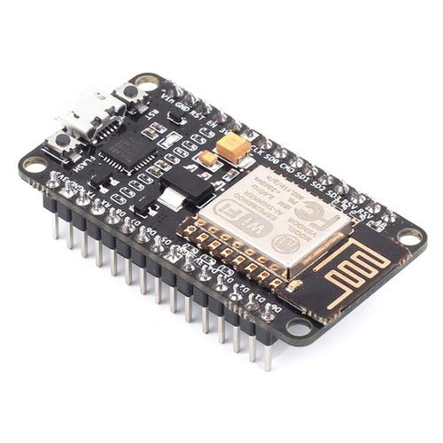
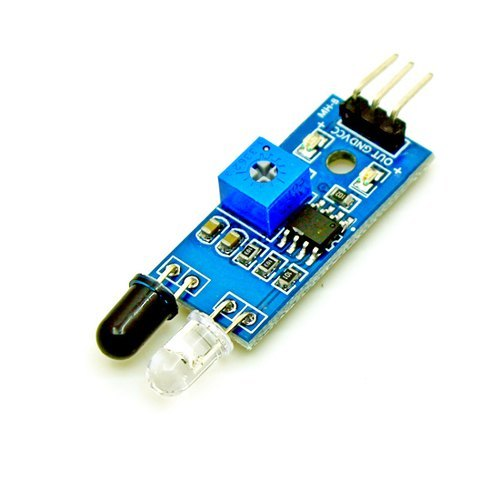
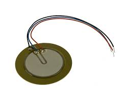

# Gym-Buddy

  
   
  

## Inspiration :

While the global pandemic rages, we still don't feel confident enough to return to Gyms, especially when they account for 2.3% of the total infections in the U.K. It is quite difficult to keep track of your activities and to know if you are doing it right without a gym instructor. So we thought of a project that could help people around the world with this problem.

## What it Does :

Gym Buddy is an inexpensive, easy-to-install, at-home pull-up and crunches instructor. It keeps track of the number of crunches and pull-ups that you do. It uses a proximity sensor to detect if you have successfully completed a pull-up/crunch ensuring that you are doing it right. This data is then displayed on our website in real-time and you get to keep a record of your daily average and the number of calories that you've burnt.

## How we built it :

We used a proximity sensor to keep track of the number of crunches and pull-ups. A piezo sensor in order to check if the device is being utilized or not and a NodeMCU to transfer this data to our database from where our website would fetch it.

## Tools

| Tool | Description |
| -- | -- |
|  | We use **NodeMCU** for processing the program and connecting it to firebase. |
|  | The **IR Sensor** is used for tracking the workout. |
|  | **Piezoelectric Sensor** is used to check if the device is being used or not. |

## Challenges we faced :

We had a hard time trying to run the program without an Arduino board, trying to interface the NodeMCU proved to be a challenge. 

## Accomplishments that we are proud of :

We were able to interface the NodeMCU which made us ecstatic. We were also able to send data to the database and fetch it in real-time.

## What we learned :

Always reset your NodeMCU before uploading new code otherwise you will waste a lot of time compiling and running the right code and getting wrong results.

## What's next :

This system can be further expanded to share these records with real-life instructors so that they can properly keep a check and provide necessary alterations.
